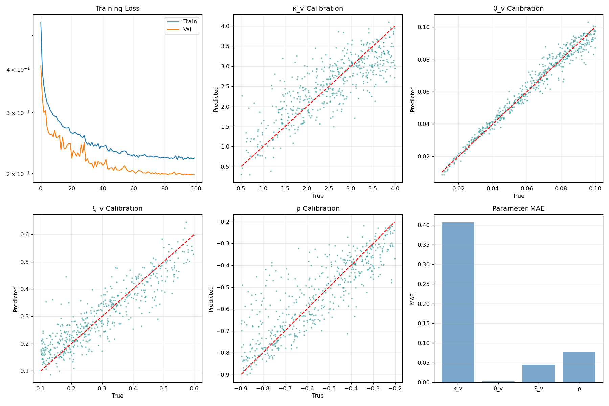
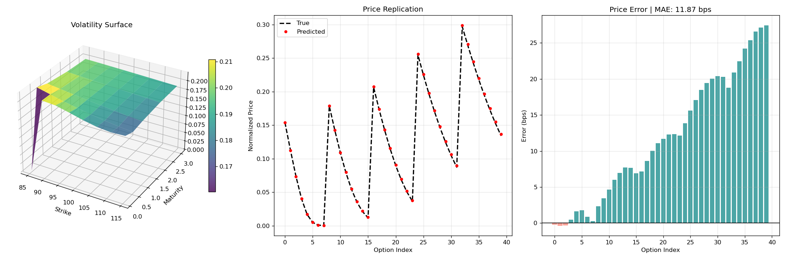

# Neural Calibration of the Heston-Hull-White Hybrid Model

This repository provides a high-performance framework for the calibration of a three-factor stochastic model, combining Heston's stochastic volatility with the Hull-White short-rate process. The system utilizes a Deep Neural Network (DNN) to solve the inverse problem of mapping observed European option price surfaces to the latent physical parameters of the underlying Stochastic Differential Equations (SDEs).

## 1. Theoretical Framework

The model simulates the joint evolution of the asset price $S_t$, its instantaneous variance $v_t$, and the risk-free short rate $r_t$:

### Asset and Variance Dynamics (Heston)
$$dS_t = r_t S_t dt + \sqrt{v_t} S_t dW_t^S$$
$$dv_t = \kappa_v (\theta_v - v_t) dt + \xi_v \sqrt{v_t} dW_t^v$$

### Short Rate Dynamics (Hull-White)
$$dr_t = \kappa_r (\theta_r - r_t) dt + \xi_r dW_t^r$$

The correlation structure is defined by $d\langle W^S, W^v \rangle_t = \rho dt$. To ensure the variance process remains strictly positive, the Feller condition ($2\kappa_v \theta_v > \xi_v^2$) is enforced during synthetic data generation.

## 2. Computational Architecture

### High-Performance Parallelization
The system employs a parallelized Monte Carlo engine optimized for high-core count environments (**50 cores**). It utilizes Python's native `multiprocessing` to generate $O(10^4)$ synthetic market scenarios. Each scenario represents a unique volatility surface spanning multiple strikes and tenors.

### Memory-Efficient Pipeline
Data generation implements a chunked, disk-backed caching strategy using compressed `.npz` archives. Normalization is performed in-place to minimize RAM residency, allowing for large-scale training on restricted-memory systems.

## 3. Results and Validation

### Parameter Recovery and Inversion
The model's ability to invert the SDE is validated through high-density calibration plots. By mapping normalized prices back to the physical parameters, the network achieves high $R^2$ scores across the test manifold.

*Figure 1: High-density scatter plots of True vs. Predicted parameters. The convergence of points along the identity line demonstrates successful neural inversion.*

### Volatility Topology and Risk Sensitivity
The engine produces a full 3D Implied Volatility Surface, allowing for the analysis of the volatility smile and term structure. Furthermore, the system computes the Vega manifold ($\frac{\partial C}{\partial \sigma}$) to evaluate the financial sensitivity of the calibration.

*Figure 2: (Left) Calibrated 3D IV Surface. (Center) Vega Risk Manifold. (Right) Risk-weighted error heatmap, quantifying the impact of residuals in basis points (bps).*

